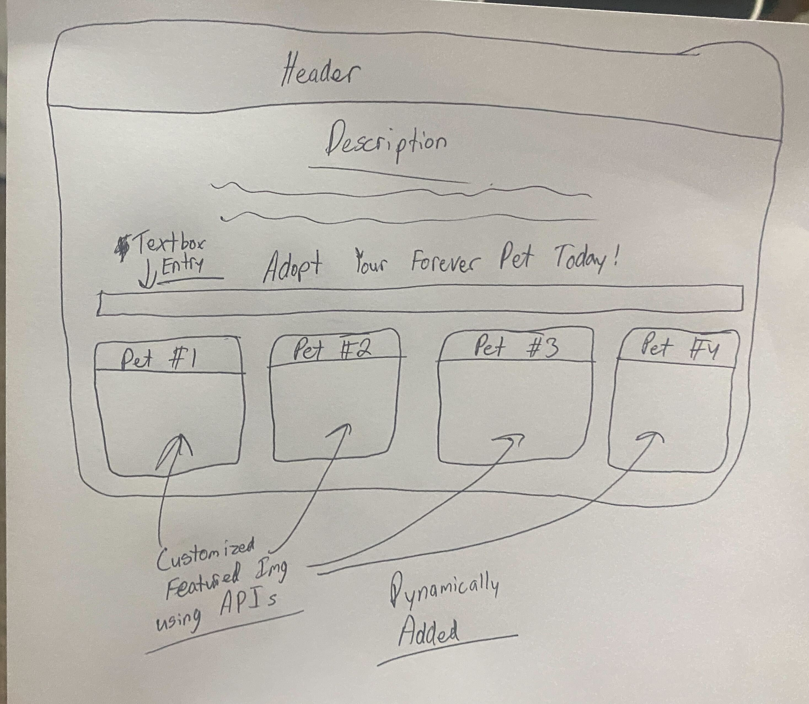

# forever-pet-adoption-app

# Title

Forever Pet Adoption

# Project description

 In this project, we want to create a pet adoption application. This application will present the user with an option to search a dog breed they're interested in. The breed the user searches if (available) will produce a list of the shelters with the breed available to adopt, a picture of the animal available, and IDK a name maybe. There are two APIs we're interested in using. The first which will allow the user to search dog breeds; and the second which will, in turn (if available) return the results mentioned prior.

# User Story

<ul>
<li>As a human that wants to adopt an animal rather than buy a puppy, </li>
<li>I want to be able to simply search animal breed I am interested in, </li>
<li> So that I can be shown a list of available animals and the hosting shelters </li>
</ul>

# Acceptance Criteria

<ul>
<li>GIVEN an adoption dashboard with inputs to search a desired breed animal </li>
<li>WHEN I search for an animal breed</li>
<li>THEN I am presented with a list of available animals </li>
<li>WHEN I view the listed animals </li>
<li>THEN I am presented with the name (if applicable) shelter name</li>
<li>WHEN I decide on the animal I am interested in and click</li>
<li>THEN I am redirected to the adoption agency/shelter webpage</li>
<li>WHEN</li>
<li>THEN</li>
<li>WHEN</li>
<li>THEN</li>
<li></li>
</ul>

# WireFrame or sketch a design

# APIs to be used

<ul>
<li>pet finder API</li>
<li>animal breed search API</li>
</ul>

# Rough breakdown of tasks

<ol>
<li>HTML - Ayden</li>
<li>JavaScript file - Shared</li>
<li>figure out APIs and get attached to correct cards - Chris</li>
<li>CSS file - Chris</li>
<li> We obviously need to work on tasks but we've got this far</li>
</ol>
